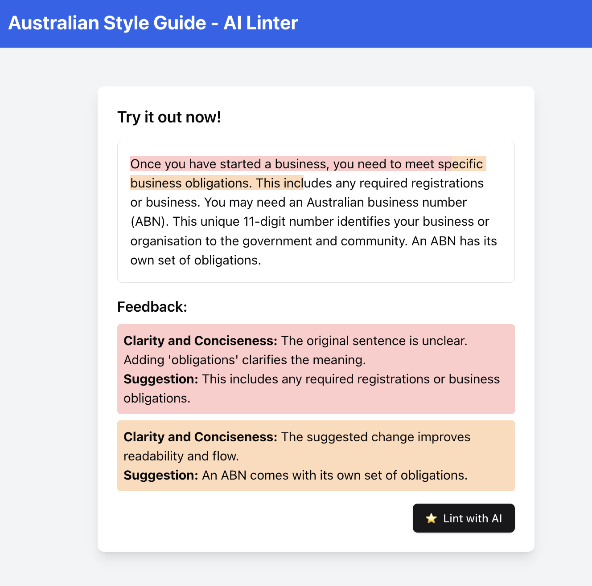

# AI-Powered Australian Style Guide Linter


## [Live Demo](https://govhack2024.vercel.app)

## Overview

This project aims to leverage AI technologies to enhance the application of the Australian Government Style Manual, making government content more clear, accurate, and user-friendly. It consists of two main components:

1. `style-guide-scraper`: A Node.js application that parses the Australian Style Guide XML.
2. `style-guide-linter`: A Next.js application that allows users to input text and receive AI-powered suggestions based on the Style Guide's grammar rules.

## Original Challenge

> How can we use AI to create clear, accurate and user-friendly government content? Specifically, how can we use AI tools to apply Australian Government Style Manual (Style Manual) rules and guidelines to create, edit and review content? Content that is clear, accurate and understandable helps people make informed decisions and comply with their obligations.

The Australian Government Style Manual is a crucial resource for ensuring consistency and clarity in government communications. This project addresses the challenge by:

- Centering government communication around people's needs
- Adhering to Australian style, spelling, and conventions
- Making content accessible to diverse audiences

## Key Features

- **AI-Powered Linting**: Utilizes ChatGPT with a system prompt formatted from the grammar/punctuation/words subsection of the Style Guide.
- **Real-time Feedback**: Highlights areas for improvement in user-submitted text.
- **Updateable Dataset**: Can be kept current by rerunning the scraper on the latest Style Guide.

## Project Structure

### style-guide-scraper

A Node.js application that:
- Pulls down specific pages from the Style Guide sitemap
- Removes HTML and converts content to markdown for easy parsing by OpenAI

### style-guide-linter

A Next.js application that:
- Provides a user interface for text input
- Calls OpenAI API with the style guide markdown file
- Highlights suggested changes based on grammar rules
- Note: requires OPENAI_API_KEY env to be set.

## Future Enhancements

- Browser Extension: For seamless integration into writing workflows
- GovCMS Integration: Automatic review of content during submission
- Specific Rule Linking: Direct references to Style Guide sections


This project was developed as part of GovHack 2024, addressing the challenge of improving government communication through AI technologies.

# From Sitemap to Markdown: The Journey of Style Guide Data

In the digital age, government communication needs to be clear, consistent, and accessible. Our AI-powered Australian Style Guide Linter project begins with a crucial step: extracting and formatting the Style Guide data. This is the story of how we transform the web-based Style Guide into a format that our AI can understand and use.

## The Source: Australian Government Style Manual

Our journey begins at `https://www.stylemanual.gov.au/sitemap.xml`. This XML file is like a map of the entire Style Manual website, listing all its pages. But we're not after everything - we're focusing on the grammar, punctuation, and conventions sections.

## Step 1: Downloading the Sitemap

Using the `axios` library, we fetch the sitemap XML. It's like grabbing the map before we start our expedition.

```typescript
const sitemapContent = await downloadSitemap(sitemapUrl);
```

## Step 2: Parsing the Sitemap

We use the `xml2js` library to transform the XML into a JavaScript object that we can work with. It's like translating the map into a language we understand.

```typescript
const urls = await parseSitemap(sitemapContent);
```

## Step 3: Filtering the URLs

We're not interested in the entire Style Manual - we're focusing on specific sections. We filter the URLs to include only those related to grammar, punctuation, and conventions.

```typescript
const filterUrlsByPath = urls.filter(url => url.includes('/grammar-punctuation-and-conventions/types-words'));
```

## Step 4: Downloading and Processing Pages

For each relevant URL, we:
1. Download the page content
2. Use JSDOM to parse the HTML
3. Remove unnecessary sections (like 'about-page-section' and 'block-webform')
4. Extract the main content
5. Convert the HTML to Markdown using TurndownService

This process is like distilling the essence of each page, removing the fluff and keeping only what's important for our AI.

```typescript
const dom = new JSDOM(response.data);
// ... (content cleaning)
const turndownService = new TurndownService();
const markdown = turndownService.turndown(prettifiedContent);
```

## Step 5: Saving Individual Files

Each processed page is saved as a separate Markdown file. It's like creating individual chapters of our Style Guide book.

```typescript
await fs.writeFile(filePath, markdown);
```

## Step 6: Combining Files

Finally, we combine all these individual Markdown files into one large file. This is our complete, AI-readable version of the relevant parts of the Style Guide.

```typescript
await combineDownloadedFiles();
```

## The Result

What started as an XML sitemap and a collection of web pages has been transformed into a single, comprehensive Markdown file. This file contains all the grammar, punctuation, and convention guidelines from the Australian Government Style Manual, ready to be used by our AI linter.

This process allows us to:
1. Focus on the most relevant content for our AI
2. Remove website-specific elements that aren't needed for content analysis
3. Create a consistent, easily parseable format for our AI to work with

By automating this process, we ensure that our AI always has access to the most up-to-date style guidelines, helping to maintain the quality and consistency of government communications.